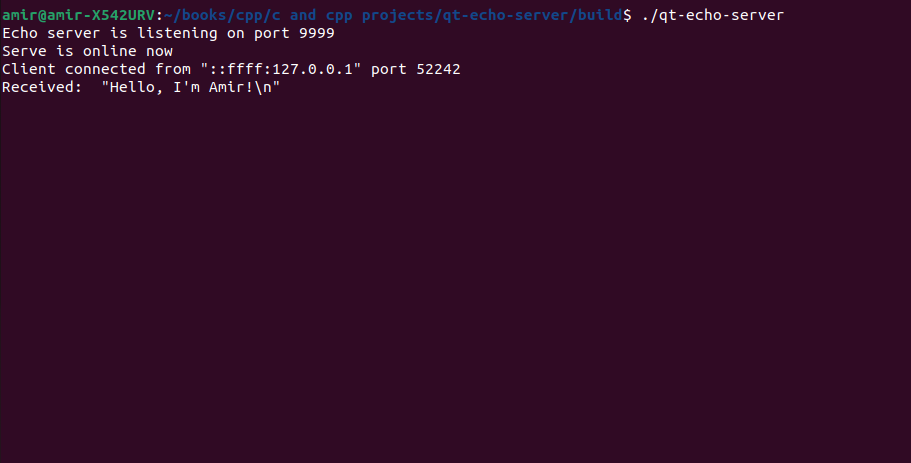
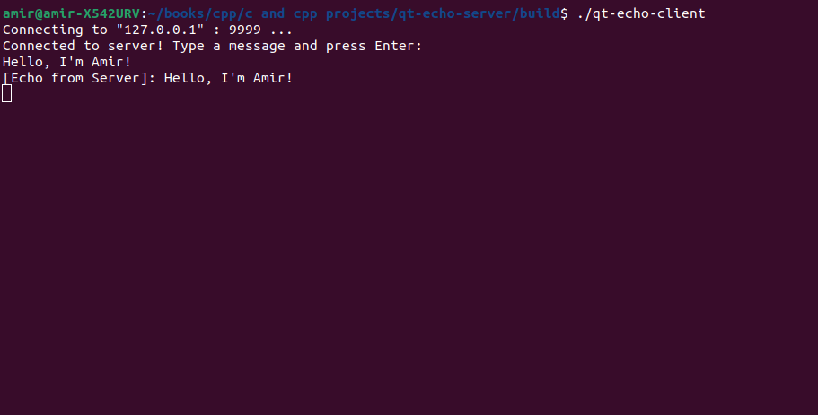

# Qt Echo Server & Client

A lightweight, high-performance asynchronous Echo Server and Client implementation built using **C++** and the **Qt 6 framework**. This project demonstrates the core concepts of network programming, including socket management, asynchronous communication, and the event-driven architecture of Qt.

## Features

- **Asynchronous I/O**: Utilizes `QTcpServer` and `QTcpSocket` for non-blocking network communication.
- **Echo Protocol**: The server automatically echoes back any data received from the client.
- **Cross-Platform**: Ready to be built on Linux, macOS, or Windows via CMake.

## Screenshots

| Echo Server Console | Echo Client Console |
| :---: | :---: |
|  |  |
*Example of successful connection and data echoing.*


## Prerequisites

Before building, ensure you have the following installed:
- [CMake](https://cmake.org/) (version 3.16 or higher)
- [Qt 6 SDK](https://www.qt.io/download)
- A C++ compiler (GCC, Clang, or MSVC)

## Getting Started

Follow these steps to build and run the project from the terminal:

### 1. Build the project
```bash
mkdir build && cd build
cmake ..
make
```

### 2. Running the Application

To start the Server:

```bash
./qt-echo-server
```

To start the Client (in a new terminal):

```bash
./qt-echo-client
```
